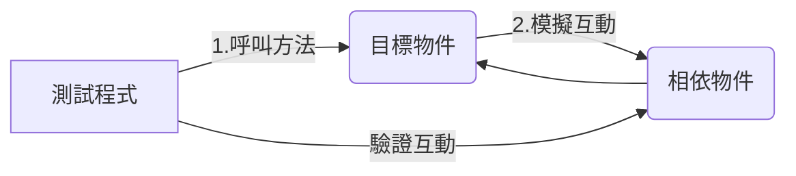
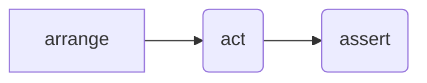

# 單元測試
## Overview
- [單元測試的定義](#單元測試的定義)
- [單元測試的特性](#單元測試的特性–first)
- [單元測試的驗證方式](#單元測試的驗證方式)
- [單元測試的效益](#單元測試的效益)
- [3A原則](#3a原則)
- [程式碼度量](#程式碼度量)
- [單元測試的命名](#單元測試的命名)
- [快捷鍵](#快捷鍵)
## 單元測試的定義
- 一個測試案例只測一種情境
- 最小的測試單位
- 不與外部資源（檔案、資料庫、網路、服務、元件等）直接相依
- 不具備邏輯判斷
- 測試案例之間的相依性為零

## 單元測試的特性–FIRST
- Fast:快速。每個單元測試的執行時間應該要很短
- Independent：獨立。單元測試不與外部資源相依，單元測試之間也不能夠相依，要能夠單獨針對測試目標進行測試
- Repeatable：可重複。所有的單元測試都可重複被執行，且不影響預期的結果。
- Self-Validating：自我驗證（可反應驗證結果）。單元測試執行不論成功或失敗，都應該要能夠從測試報告裡直接瞭解其意義或失敗的原因
- Timely：及時。單元測試應該在產品程式碼完成的當下就可以驗證執行結果是否符合預期

## 單元測試的驗證方式
- 驗證測試目標物件的方法回傳值是否符合預期
- 驗證測試目標物件的狀態改變是否符合預期
- 驗證測試目標物件與相依物件的互動是否符合預期

1. 驗證回傳值

2. 驗證與相依物件的互動

## 單元測試的效益
- 成本下降
- 提升信心
- 穩定的開發節奏
- 團隊合作與共識
- 快速交付、快速回饋

## 3A原則

1. Arrange
- 初始化目標物件
- 初始化方法參數
- 建立模擬物件行為
- 設定環境變數期望結果
2. Act
- 實際呼叫測試目標物件的方法
3. Assert
- 驗證目標物件是否同預期操作

## 程式碼度量
1. 分析 > 計算方案的程式碼度量

2. 程式碼度量結果
五種指標：
- 可維護性指標 (Maintainbility Index)
- 循環複雜度 (Cyclomatic Complexity)
- 繼承深度 (Depth of Inheritance)
- 類別結合程度 (Class Coupling)
- 程式碼行數 (Lines of Code)

### 可維護性指數
>  **（這個項目要越高越好）**
- 算出介於 0 到 100 之間的指數值，代表維護程式碼的相對難易程度。
- 值愈高表示可維護性愈佳。
- 色彩編碼分級可用來快速識別程式碼中的問題點。
    - 綠色等級介於 20 和 100 之間，表示程式碼的可維護性良好。
    - 黃色等級介於 10 和 19 之間，表示程式碼的可維護性適中。
    - 紅色等級是介於 0 和 9 之間的等級，表示可維護性低。

### 循環複雜度
> **這個項目要越低越好** 
- 測量程式碼在結構上的複雜程度。
- 建立此複雜度的方式是計算程式流程中不同程式碼路徑的數目。
- 控制流程較為複雜的程式需要執行較多的測試，才能達到正確的程式碼涵蓋範圍，而且比較不容易維護。
- 建議每一個成員(也就是 method )不超過10，或不超過15。

### 繼承深度
> **(這個項目越低越好)**
- 指出延伸到類別 (Class) 階層的根 (Root) 的類別定義數目。
- 階層愈深，可能愈難找出定義與/或重新定義特定方法和欄位的位置。

### 類別結合程度
- 透過參數、區域變數、傳回型別、方法呼叫、泛型或樣板具現化、基底型別、介面實作、外部型別上定義的欄位以及屬性修飾等，測量特殊類別的結合程度。
- 良好的軟體設計應指定聚結性 (Cohesion) 高但結合程度 (Coupling) 低的型別和方法。
結合程度高表示設計不易重複使用，因為這種設計包含對其他型別的許多相依性。

### 程式碼行數
- 指出程式碼中行數的約略值。 這個數目是以 IL 程式碼為依據，因此不是原始程式碼檔案中精確的行數。
- 如果數目非常大，表示型別或方法嘗試執行的工作可能過多，而應該分割工作。 這也表示該型別或方法可能難以維護。

## 單元測試的命名
- 被測試方法名稱 - Add
- 測試場景描述 - first_1_second_2
- 預期行為 – should_be_3

- 單元測試方法的命名是可以使用中文，更容易清楚瞭解該單元測試方法的測試案例

## 快捷鍵
- testc建立測試類別
- testm 建立測試方法 
- Ctrl+R, T: 執行單一測試
- Ctrl+R, A: 執行所有測試（開發時最常使用）
- Ctrl+R, Ctrl+T: 偵錯單一測試（測試失敗時，最常使用）
- Ctrl+R, Ctrl+A: 偵錯所有測試

### 參考
https://blog.miniasp.com/?tag=%e5%96%ae%e5%85%83%e6%b8%ac%e8%a9%a6