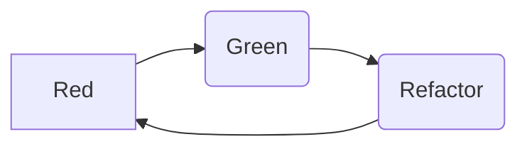

# TDD測試驅動開發
## Overview
- [TDD簡介](#簡介)
- [TDD的基本開發流程](#tdd-的基本開發流程)
- [重構與測試](#重構與測試)

## 簡介

- 透過測試（單元測試）推動整個開發的進行
- 在撰寫程式碼之前，先透過測試案例的撰寫，確定外部如何使用物件，包含了功能、類別、方法的確定
- 以需求為出發點，開發符合需求的程式，避免過度設計（Over Design）

## TDD的基本開發流程

1. 定義目前要完成的功能（確定需求）
2. 撰寫測試案例。撰寫的過程應針對意圖進行命名，思考需要得到什麼結果，要得到這樣的結果會需要提供什麼資訊。
3. 編譯測試程式**不通過**。
4. 撰寫對應測試程式的功能程式碼。
5. 讓測試通過。
6. 對程式碼進行**重構**，並確保測試可以通過。
7. 依照同樣的**循環**，完成所有的功能開發。

- 寫測試:執行此測試一定會失敗
- 寫程式:目標是通過前一個失敗測試
- 重構:調整架構或移除程式，重構後須通過所有測試
TheThreeRulesOfTdd)
### What is refactor ?
在不改變軟體外部行為的前提下， 改變其內部結構， 使其更容易理解且易於修改

重構的過程是去除重複、簡化複雜邏輯、 釐清模糊且難以維護的程式碼

重構的時候不會破壞原有的行為，也不會增加新bug

### TDD的三原則
1. 除非這能讓失敗的單元測試通過， 否則不允許去編寫任何的產品代碼。
2. 只允許編寫剛好能夠導致失敗的單元測試。
3. 只允許編寫剛好能夠導致一個單元測試失敗的產品代碼。

[The Three Laws of TDD.](http://butunclebob.com/ArticleS.UncleBob)

[測試驅動開發的一般原則](https://blog.csdn.net/hudon/article/details/1123700)
### 重構與測試

- 重構必須要保證修改前後的輸入與輸出一致
- 要保證每個重構步驟的安全性，為了確保每次的修改不會造成破壞， 必須使用測試做驗證
- 循序漸進的進行重構，每一次的修改都加上測試，防止錯誤的產生
- 重構要有測試保護
- 小範圍重構的效益，比大範圍重構來得有效
- 先有 Code 再重構，比一開始設計時套用一堆 Design Pattern 來得精準
- 一次只做一件事情，不要一邊重構一邊加需求

### Example
